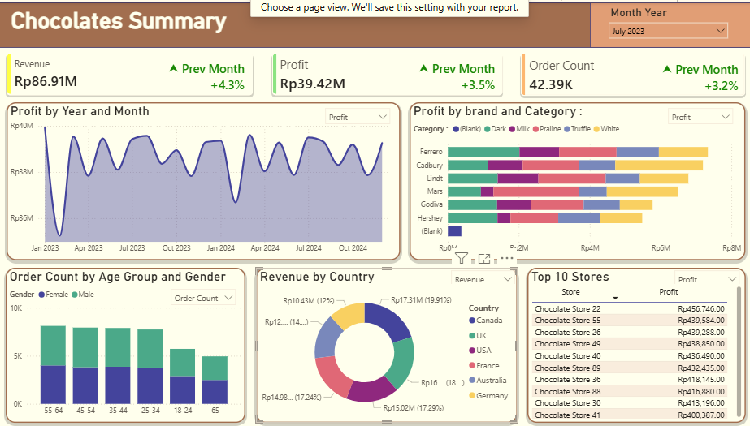

# Retail-Analysis-and-Dashboarding
# 🍫 Global Chocolate Sales & Profitability Intelligence Dashboard



## 📌 Project Overview
This project delivers a comprehensive, interactive Business Intelligence dashboard built in **Microsoft Power BI** to analyze global chocolate sales performance, financial metrics, and customer purchasing behaviors. Utilizing a simulated retail dataset sourced from Kaggle, the dashboard equips stakeholders with granular visibility into revenue streams, brand profitability, store rankings, and demographic trends across international markets.

---

## 🚀 Key Features & Interactive Visualizations

* **Executive KPI Summary Cards:** Real-time tracking of core business metrics—Total Revenue, Net Profit, and Total Order Count —supplemented by month-over-month (MoM) growth indicators.
* **Profit Trajectory (`Profit by Year and Month`):** Time-series line visualization mapping profit fluctuations across 2023 and 2024 to diagnose cyclical trends and volatility.
* **Product Performance Matrix (`Profit by Brand and Category`):** Stacked bar breakdown evaluating profit margins across top-tier brands (e.g., Ferrero, Cadbury, Lindt, Mars, Godiva) and product lines (Dark, Milk, Praline, Truffle, White).
* **Customer Segmentation (`Order Count by Age Group and Gender`):** Dual-axis segmented chart analyzing purchasing volume across diverse age cohorts and gender demographics.
* **Geographic Market Share (`Revenue by Country`):** Donut chart illustrating international revenue distribution across Canada, the UK, the USA, France, Australia, and Germany.
* **Store Leaderboard (`Top 10 Stores`):** Ranked performance table highlighting the highest-performing retail locations (led by *Chocolate Store 22* and *55*).

---

## 🛠️ Technical Stack & Skills Demonstrated
* **Tool:** Microsoft Power BI Desktop
* **Data Modeling & Transformation:** Power Query, DAX (Data Analysis Expressions) for custom measures, calculated columns, and time-intelligence calculations.
* **UI/UX Design:** Custom layouting, consistent color palettes, card design, and responsive slicer integration (e.g., global *Month-Year* filter).

---

## 💡 Key Business Insights
1. **Revenue vs. Margin Seasonality:** While overall monthly revenue trends remain relatively stable, profit dips in early 2023 and early 2024 indicate margin compression during post-holiday quarters, likely driven by promotional discounting or supply chain cost fluctuations.
2. **Category & Brand Dominance:** Premium brands (such as Ferrero and Lindt) combined with *Dark* and *Praline* categories command the largest share of profitability, showing that high-end segments drive bottom-line growth over bulk mass-market items.
3. **Core Demographic Engagement:** Customer purchase frequency is heavily concentrated in the **25–54** age brackets, with a balanced gender distribution that highlights broad appeal among working-age adults.
4. **Geographical Concentration:** Revenue is evenly distributed across key international markets (led closely by Canada, the UK, and the USA), indicating a stable multi-region footprint rather than heavy reliance on a single country.

---

## 📈 Recommended Actionable Takeaways
* **Optimize Low-Margin Seasons:** Investigate the root causes of Q1 profit contractions (e.g., post-holiday discounting or shipping cost surges) and implement dynamic pricing strategies or bundled promotions to protect margins early in the fiscal year.
* **Expand Premium Inventory:** Capitalize on the high profitability of *Dark* and *Praline* varieties by featuring premium product bundles in top-performing retail locations (*Store 22*, *Store 55*).
* **Targeted Marketing Campaigns:** Design digital marketing and loyalty initiatives tailored specifically to the high-converting 25–44 age demographic to increase average order value (AOV).
* **Geographic Penetration:** Leverage successful marketing frameworks from top-performing countries (UK/Canada) to scale operations in underrepresented European or Australian markets.

---

## 📦 Getting Started & Repository Structure

To explore or interact with the dashboard:

1. **Clone the repository:**
   ```bash
   git clone [https://github.com/your-username/chocolate-sales-dashboard.git](https://github.com/your-username/chocolate-sales-dashboard.git)
